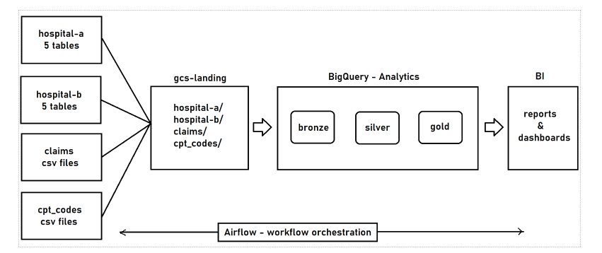
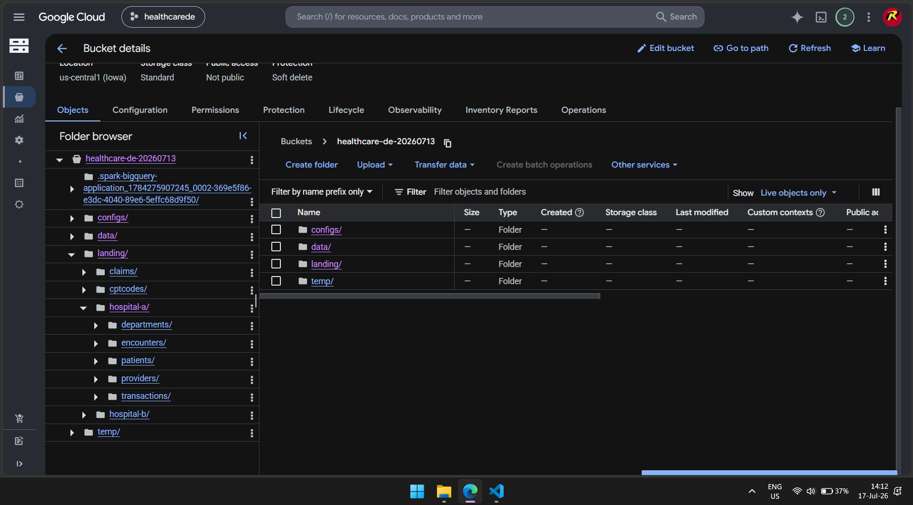
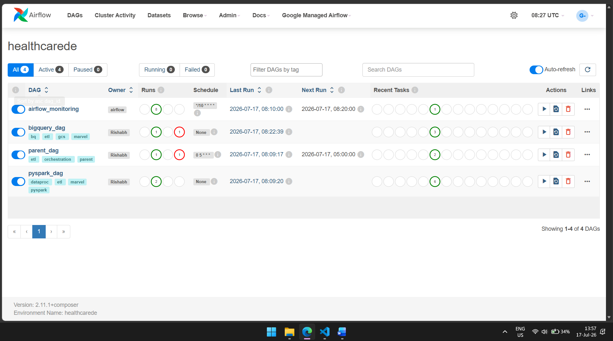
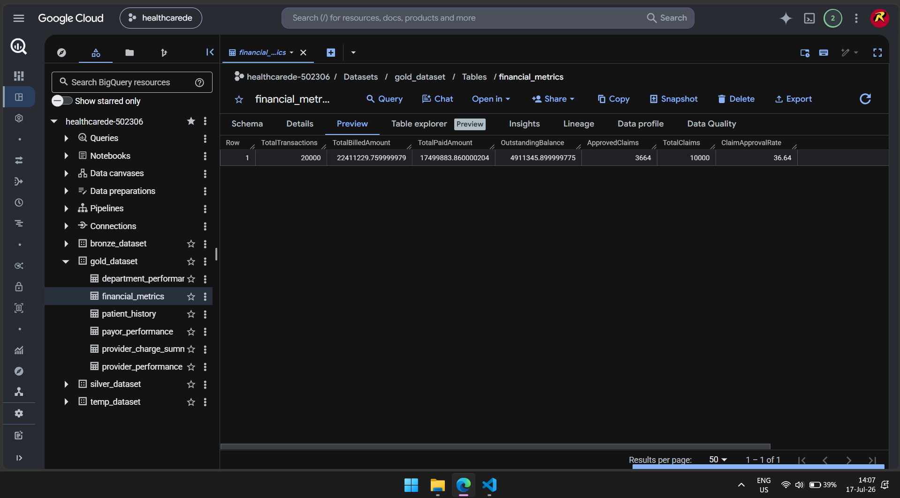

# GCP Healthcare Data Engineering Project

End-to-end healthcare data engineering pipeline on Google Cloud Platform (GCP) for Revenue Cycle Management (RCM).

## Project Goal
Build a simple medallion-style data platform to ingest healthcare data from multiple sources, orchestrate workflows with Airflow, and deliver analytics-ready outputs in BigQuery.

## Architecture


## Data Sources
- Cloud SQL (MySQL): EMR data from Hospital A and Hospital B
  - patients, providers, departments, encounters, transactions
- Claims flat files (CSV)
- CPT codes (CSV)
- External reference APIs (NPI, ICD)

## GCP Services Used
- Cloud Storage (landing and staging)
- Cloud SQL (MySQL)
- Dataproc (PySpark processing)
- BigQuery (bronze, silver, gold layers)
- Cloud Composer / Airflow (orchestration)
- Cloud Build (deployment support)

## End-to-End Flow (Simple)
1. Ingest source data into Cloud Storage landing paths.
2. Run PySpark jobs on Dataproc for transformation and loading.
3. Build BigQuery bronze -> silver -> gold layers.
4. Orchestrate full pipeline using Airflow DAGs in Composer.
5. Use gold tables for reporting and dashboarding.

## Key Outputs

### Landing Bucket Snapshot


### Airflow Final Run Status


### BigQuery Gold Output


## Dataproc Cluster Setup (CLI)
```bash
CLUSTER_NAME="my-demo-cluster"
REGION="us-east1"

gcloud dataproc clusters create "${CLUSTER_NAME}" \
  --region="${REGION}" \
  --num-workers=2 \
  --worker-machine-type=n1-standard-2 \
  --worker-boot-disk-size=50 \
  --master-machine-type=n1-standard-2 \
  --master-boot-disk-size=50 \
  --image-version=2.0-debian10 \
  --enable-component-gateway \
  --optional-components=JUPYTER \
  --initialization-actions="gs://goog-dataproc-initialization-actions-${REGION}/connectors/connectors.sh" \
  --metadata="bigquery-connector-version=1.2.0,spark-bigquery-connector-version=0.21.0"
```

## Challenges Faced
- We stored logs in a BigQuery audit table for incremental load.
- Dataproc could not connect to Cloud SQL at first. We fixed it using VPC and private IP.
- For patients and transactions, old files are archived first, then new data is loaded (incremental).
- Composer setup failed first because some APIs were disabled. We enabled them and it worked.
- Airflow DAGs did not show up at first because of wrong Composer bucket details.
- Bronze step failed because Hospital A audit table was missing. We recreated required landing/data setup and ran again.

## Repository Structure
```text
project/
  data/
    BQ/
    claims/
    cptcodes/
    EMR/
    INGESTION/
  workflows/
  utils/
  cloudbuild.yaml
```

## Author
Rishabh
